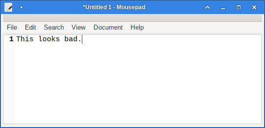
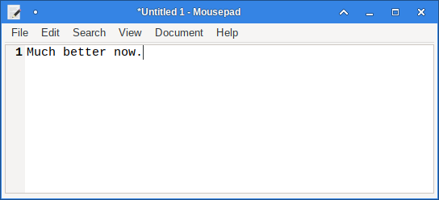
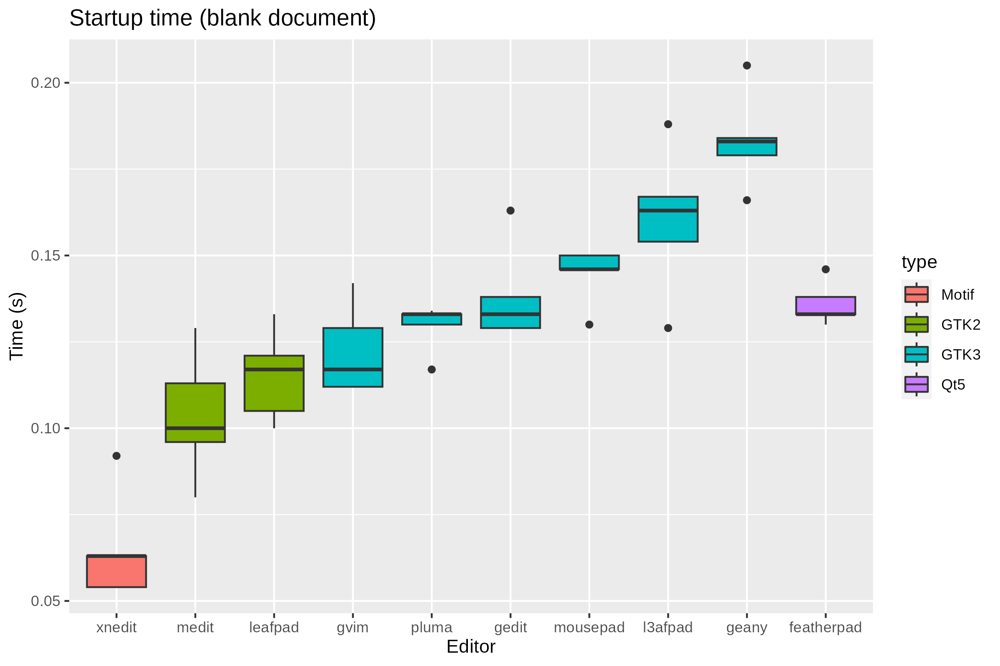
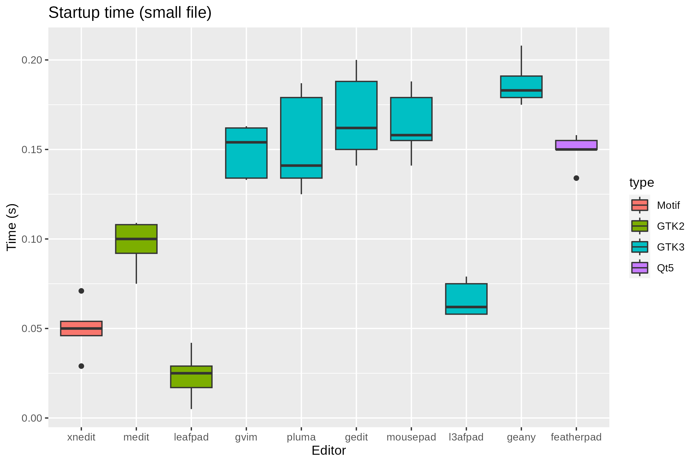
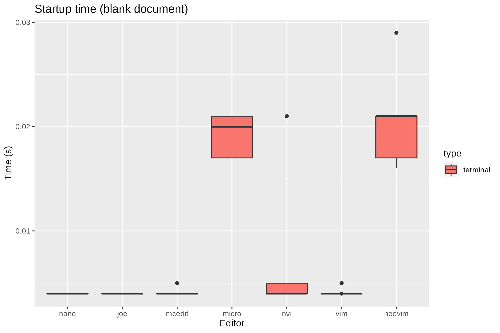
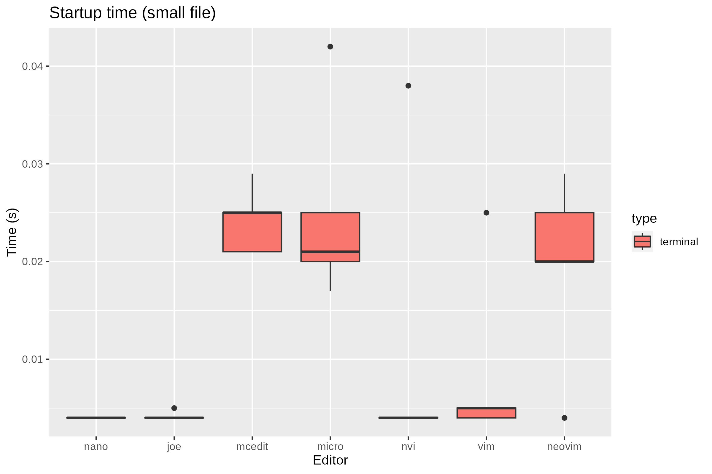
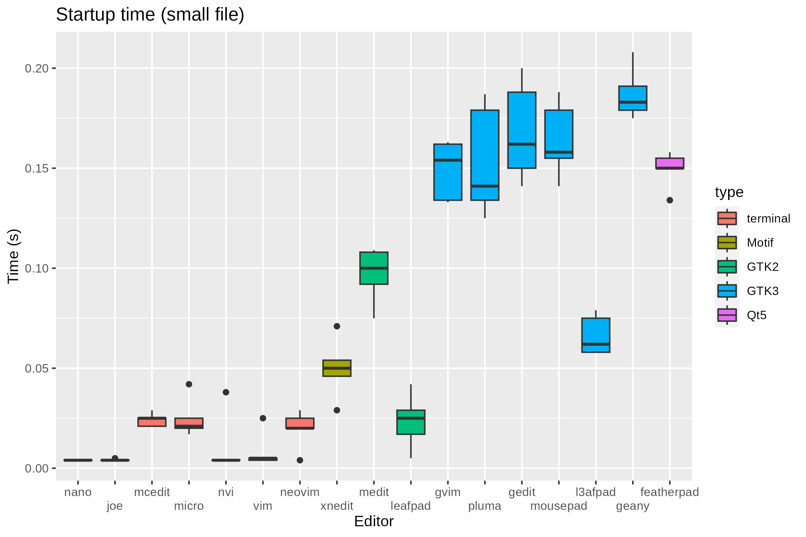
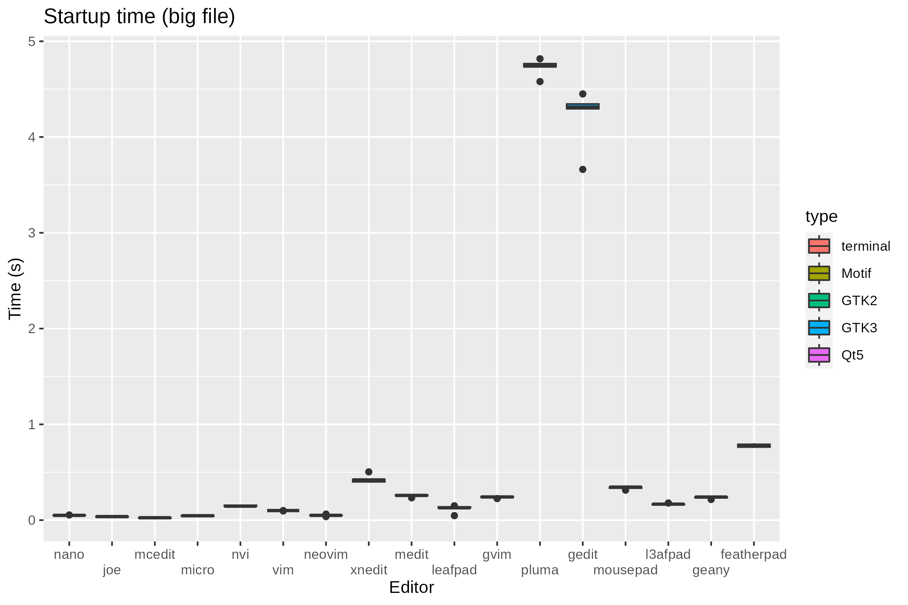

Even during the development phase of Salix 15.0, more than a year ago, I was
getting questions and comments about which the default (GUI) text editor would
be. I still get those questions in my inbox. So, Salix 15.0 came with Xfce
4.16. And Xfce's default text editor is Mousepad, but we elected not to include
it in the default app selection for our release. Instead, we included
[L3afpad](https://github.com/stevenhoneyman/l3afpad), which is essentially a
GTK3 port of
[Leafpad](http://tarot.freeshell.org/leafpad/), the default editor in all our
previous releases, including at least Salix 14.2, 14.1 and 14.0, going back
more than 10 years now.

In all honesty, I don't remember the exact details why we went with Leafpad
back then. I vaguely remember there was a bug with Mousepad that we didn't
like. But I do remember that we had some extensive talks about it. And I
remember that one of the reasons why we had chosen Leafpad was its speed. It
started up faster than Mousepad, without having any less features, even if
that difference in startup speed was only very small.

Now, Xfce 4.16 (and newer) is based on GTK3 and Leafpad being a GTK2 app, it
wouldn't fit that well in our default installation, which includes only GTK3
apps (with the exception of GIMP, which doesn't have a GTK3 release yet).
So, we had to choose a GTK3 text editor and Mousepad was certainly an option
again.

Xfce 4.16, which was the latest Xfce version when Salix 15.0 was originally
released, came with Mousepad 0.5.8. Unfortunately, the Mousepad developers
had decided that they should move to using CSD (Client Side Decorations)
exclusively, following the example of GNOME. I find the idea of CSD appaling.
There is already a lot of critisism about them online, I won't go into
details here, but they are generally critisized for lack of consistency across
apps, no theming support, wasted screen space, reduced window management
control, fragmentation in development, accessibility problems, performance
issues and integration. Maybe that's a topic for another post, but the point
is that they are a terrible idea born within GNOME and forced on the Linux
community.

In Salix 15.0, we decided to remove any CSD using a small module called
gtk3-nocsd. This removes CSD from windows and allows the window manager to
work as usual. It's a hack, but it works. Unfortunately, with Mousepad 0.5.8
it doesn't work that well. The result is an ugly, empty, horizontal grey bar
at the top of the window, between the top bar provided by the window manager and
the window menu, as shown in the next screenshot.

This just wasted screen estate. And there was no way to remove it. There was no
way we would include it as a default application looking like that. L3afpad
presented itself as a GTK3 port of Leafpad and we saw that it would fit great
with our Xfce desktop. What we need is a simple text editor that would launch
really fast, that can be used for simple editing tasks and note keeping and
generally be out of the way. For more complex editing tasks, syntax
highlighting and programming, we have [Geany](https://www.geany.org/), which is
very powerful, while also remaining lightweight. But for simple editing tasks
and note keeping, we need an editor that is even more lightweight than Geany.
L3afpad was an almost perfect match for what we wanted, although a major
drawback was that it seemed that its development has stalled. There have been
no new commits in its repository since February 2022. But there were no major
bugs, so there was little risk in using it, indeed it works great!

And then, after Salix 15.0 was released, Xfce 4.18 came along and it included
Mousepad 0.5.10. For those that haven't realized, we have
[repositories for Xfce 4.18](https://forum.salixos.org/viewtopic.php?f=17&t=8521)
and all Salix 15.0 users are welcome to use them as we thing Xfce 4.18 is
a considerable upgrade to Xfce 4.16. Upgrading is completely painless and it
only involves adding a single repository in your repository sources. Having a
new Salix release with Xfce 4.18 has been a thought since last December, but
considering how easy it is to upgrade a new installation from 4.16, I have
always pushed it to the back of my TODO list.

Anyway, with Mousepad 0.5.10, it seems that its developers listened to a big
part of the community and decided to make CSD optional. Now, if you disable CSD,
it looks like this:

And just like that, Mousepad is a valid option as a default application again.

Probably the major deciding factor on which text editor to use as default
would be how fast each one of them is. I remember Leafpad felt faster than
Mousepad in the past and I was expecting the same to be true when comparing
L3afpad and the newest Mousepad release. Recent releases of Mousepad have also
added a lot of additional functionality, such as support for tabs, syntax
highlighting and theme support, so I thought any difference between them could
only have increased in favour of L3afpad as Mousepad probably got heavier due
to these additions.

Don't get me wrong, both apps are really fast, but there is probably a
difference between "almost instant" and "really fast" and something was itching
me to find it.

So, I decided to do a small experiment. I would launch each application a few
times and record how much time it took to start. I could do that by making a
recording of my screen at the same time.

## Methodology

All measurements were conducted on my laptop, which is the only PC I have with
me right now, as I'm away from home. It is a somewhat fast system, with a
4 thread/8 core i7-1165G7 @ 2.80GHz, 32GB of RAM and a 1TB NVMe drive. Running
the same experiment on a slower system would probably increase times and
augment any differences, but there shouldn't be any confusion as to which one
is faster, if indeed one of them is. An advantage on using a fast system for
my little experiment, is that dedicating one core (or part of it) for doing
the screen recording, shouldn't affect the results much, if at all.

The way it went on is this: I started ffmpeg recording part of my screen, right
at the center, where applications would launch. I didn't need to record the
whole screen, as that would strain my CPU more. I wanted to be sure that I
would be able to detect even subtle differences, so I ran the recording at 240
fps. I then opened a terminal and launched each app from there. I did that five
times for each application as I didn't want my results to be affected by any
scheduling hickup with my CPU or any other temporary issue. I may get one
outlier, but most measurements should be tightly packed.

I then opened the recorded video in [avidemux](https://avidemux.sourceforge.net/)
and stepped through it frame by frame. With such a high framerate, each frame
was offset from the previous one roughly by 0.004 seconds. So, that was the
granularity of our results, meaning that we couldn't detect differences smaller
than that, but that would be more than enough, nobody can feel differences
that short. I noted the timestamp of the last frame that my cursor was at
the end of the command line (just before pressing the Enter key) as well
as the timestamp of the first frame that the application would launch and
all graphical elements would be visible and ready for interaction, including
window manager controls and the application's widgets themselves.

## Mousepad vs L3afpad startup times

I then calculated the difference between the two times, which would be my
startup time for each app and plotted them using a boxplot in
[R](https://www.r-project.org/). What I got was this:

That was a surprise! I wasn't expecting these results at all! My own
preconceptions made me think that L3afpad would have been faster, or at the
worst case, the difference wouldn't be significant. After all, Mousepad has so
many more features as I noted earlier. But the difference is significant, in
favour of Mousepad! Even if the difference is only about a hundredth of a
second. But it didn't feel like that when I was just starting them up without
actually doing any measurements. It was either that L3afpad felt just a tiny
bit faster or that I couldn't tell the difference. I was wrong!

## Extending the experiment

So, that got me thinking. What else do I have figured out wrong due to my
preconceptions? Geany, even if really fast, feels a bit slower to start than
L3afpad or Mousepad. Is that true, or just my idea too? What about GTK2 vs
GTK3? I think that GTK3 made everything a bit slower, but is that really so?
What about launching a Qt app in a GTK3 environment, would that have a
significant overhead?

My major focus would of course be GTK3 apps, since Xfce uses that, so I picked
a few of them from the Salix repositories and added a few more made with other
toolkits for good measure. The complete list of GUI editors I tried is this:

* xnedit 1.4.1 (Motif)
* medit 1.2.0 (GTK2)
* leafpad 0.8.18.1 (GTK2)
* gvim 9.0.1667 (GTK3)
* pluma 1.26.0 (GTK3)
* gedit 42.0 (GTK3)
* mousepad 0.5.10 (GTK3)
* l3afpad 0.8.18.1.11 (GTK3)
* geany 1.38 (GTK3)
* featherpad 1.2.0 (Qt5)

And here are the results:

There are some very interesting results here!

It's amazing how much faster xnedit is, compared to everything else! It blows
everything else away and the difference is definitely perceptible. Launching
xnedit feels (and is) almost instant. Sure, Motif is an older toolkit and you
may have expected it to be somewhat faster, but xnedit is loaded with features.
I wasn't expecting such a huge difference. If you don't mind the old-school
looks, this is the editor to use if you care about speed. It would certainly be
ideal for older systems, but again, you can feel the difference in speed with
newer systems too.

Both GTK2 apps, Medit and Leafpad, are faster to load than almost all GTK3
apps, even in a GTK3 based environment like Xfce 4.18. Especially, the
difference between Leafpad and L3afpad is huge, and the latter is nothing more
than a direct port of the former to GTK3, they should be directly comparable.
Porting it to GTK3 made it a lot slower.

Of the GTK3 apps, Gvim is the fastest one. I was expecting that. In most cases
it's almost as fast as the two GTK2 apps. And it is certainly the editor with
the most features. It's vim after all. If you're a vim user, Gvim is the easy
choice. But I understand that not everyone likes vim, so it can't be the
default editor in Salix anyway.

And then there's another surprise! Both Pluma and Gedit are faster than
Mousepad and L3afpad! I wasn't expecting this either. They both have a lot
more features than L3afpad, while the newer Mousepad releases are probably
on par. Gedit's interface has followed recent developments in GNOME and now
looks completely out of place in Xfce though. If you like that, I guess it's
OK. But Pluma, which comes from the MATE project, fits right in.

Geany is the slowest of all GTK3 apps, but I was expecting that too. I mostly
added it to the comparison to serve as a high anchor. Nothing should be slower
that Geany, with all the features it has and nothing really isn't. I don't know
if it can be considered just a text editor, it's mostly a lightweight IDE, if
anything, and that is the reason it is included as a default app in Salix. That
is not going to change.

And then comes the last surprise! Featherpad, the only Qt5 app in the list is
faster than both Mousepad and L3afpad. I had expected launching a Qt5 app in
a GTK3 environment to take some toll, but it seems that it hasn't. It's just
as fast as the fastest GTK3 apps in the list (well, except Gvim).

## Loading files

And if that's not enough testing and results, I decided to go even further.
Why not try all these editors all over again, this time loading some text
files instead of a blank document.

So, I chose two files, a small one and a somewhat big one. The small file
was the SLKBUILD file for the mozilla-firefox package in our repositories. Its
size is exactly 3442 bytes. The big one was the `/var/slapt-get/package_data`
file that holds all package data information for our package manager,
slapt-get. Its size is about 8.5 MB. To make matters a bit worse, there are
some encoding errors in this file, which will probably give some trouble to
some editors.

Here is what I got for the small file:

Hah! Leafpad and L3afpad are so much faster than they were before! They are
both a lot faster in loading an existing file than starting with a blank
document! Leafpad is now the fastest editor and L3afpad the 3rd fastest.
L3afpad is by far the fastest editor among the GTK3 ones.
So, it turns out I wasn't that crazy when I felt that L3afpad (and
Leafpad) were actually faster than everything else! And the difference is
about a tenth of a second, you can definitely feel that.

Xnedit is still very fast, the fastest one after Leafpad and I'm still very
impressed! It is also a bit faster in loading an existing file, instead of
starting a new one, but the difference is not as pronounced as with the
L*afpads.

Medit is also fast and Geany is still the slowest one, but with both there are
virtually no differences between loading a small file or starting with a blank
one.

All other editors have no significant differences between them and they are a
tiny bit slower to load a small file than starting with a blank.

So, what about loading the big file? Here we go:

What happened here? Both Pluma and Gedit are terribly slow compared to
everything else. They both show a progressbar while parsing the entire file
and they take several seconds to finish. You are not able to start editing
until they are done. 

Since they are so slow, I removed them and plotted everything else to be
able to see what's going on with better detail:

The L*afpads are the fastest! All editors are slower in loading the big file
than the smaller one. Xnedit especially takes a toll here. I'm thinking that
this may be due to the encoding errors that the big file has. Featherpad is
also a lot slower than it was, it is now the 3rd slowest, after Pluma and
Gedit.

The pleasant surprise comes from Geany. It is now the 3rd fastest editor to open
the big file, right after the L*afpads. It's looking like the L3afpad + Geany
combination for a simple editor and lightweight IDE/more complex editor,
respectively, is not that bad after all!

## Terminal editors

You think that was enough, right? Well, no. Now I just had to do the same for
terminal editors. They all feel faster than the GUI editors, but could I be
wrong again? And are there any differences between them?

So, I run my experiment a few more times with these terminal editors:

* nano 2.6.0
* joe 4.6
* mcedit 4.8.27 (from the mc package)
* micro 2.0.10
* nvi 1.81.6
* vim 9.0.1667
* neovim 0.7.2

Terminal editors is probably the only app category for which we break the
"one application per task" rule for our default installation. They are very
small in size after all. And you absolutely have to include a vi-like editor,
so in 15.0 we have neovim, which is very powerful. But not everyone likes
vi-like editors, so we also include nano. And then there is also mcedit, which
is bundled with the mc package.

There are a lot more editors I could have included here (same with the GUI
editors of course), like perhaps elvis, but I only wanted to test editors
that support UTF-8 and elvis doesn't.

Here are the results for starting with a blank document:

Impressive! Most editors start instantly! As in after a single frame of the
captured video, the editor is ready and waiting, that is within 0.004 seconds!
The only exceptions are micro and neovim. I'm not sure why neovim is slower
than vim in this context, they are comparable in features and neovim is
supposed to have removed cruft from the vim codebase. Could it be the
respective default configurations? I don't think they are that different.
Anyway, it's not that micro and neovim are too slow, they only take about 0.02
seconds to start, you can probably never feel that difference.

So, what about opening our small file?

Nano, joe, nvi and vim are instant with this one too. Neovim and micro are
still slower than the rest, but they are only a tiny bit slower than with
the blank document. On the other hand, mcedit is now as slow (or should I
say "as not incredibly fast") as neovim and micro.

And what about opening the big file?

Things change a lot! Opening the file is still perceptibly almost instant in
most cases, but it's not within a single frame for any editor. The fastest
editor is now mcedit! It doesn't look like it needed more time opening the big
file compared to the small file. Joe is still very fast and micro is now 3rd
faster! Vim is now slower than neovim taking almost double the time neovim
does. And nvi is by far the slowest, you can almost tell the difference with
this one.

## All together

And to put everything into perspective, here is a graph with all terminal
and GUI editors together, when opening a blank document:

When opening the small file:

When opening the big file:

And same thing, opening the big file, without Pluma and Gedit, which are
too slow to compare with everything else:

It is pretty clear that the terminal editors are a lot faster than the GUI
ones. The only GUI editors that come close are the two L*afpads and Xnedit,
especially when opening an existing file.

Of course all these experiments and measurements don't say anything about what
actual editing feels like. For example, I know for certain than doing a search
and replace in vim/gvim is very fast, but it might take ages with the
L*afpads, especially if you're working on a big file.

But the use case for a simple editor is that you need something for quick
editing, no syntax highlighting or anything like that, or to keep some simple
notes. For more complex things, you would turn to Geany. Or if you like vi-like
editors to one of those, but again, I understand that's not for everyone.

So, where does that leave us? Ultimately, I think we made the right choice with
going for L3afpad and Geany. Geany is powerful and full of features while also
lightweight. And L3afpad is fast for the simple use cases of note taking and
simple editing it is intended for. One thing to consider would be its
development status. If in the future it seems that it is completely abandoned and major bugs
appear we will probably switch to Mousepad or Pluma.
